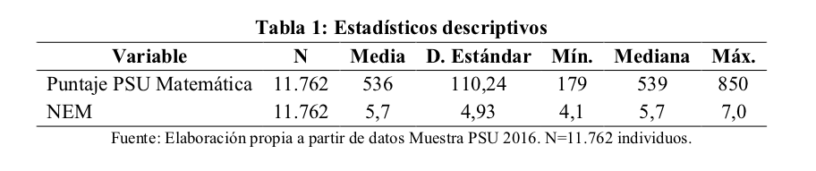
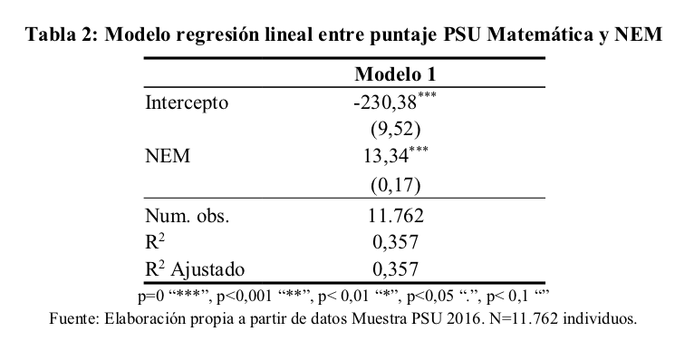
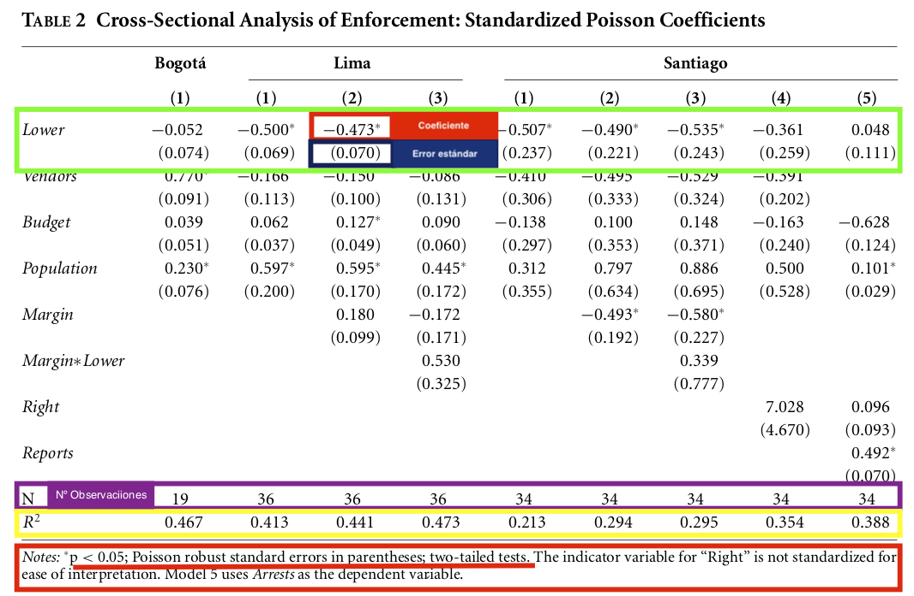
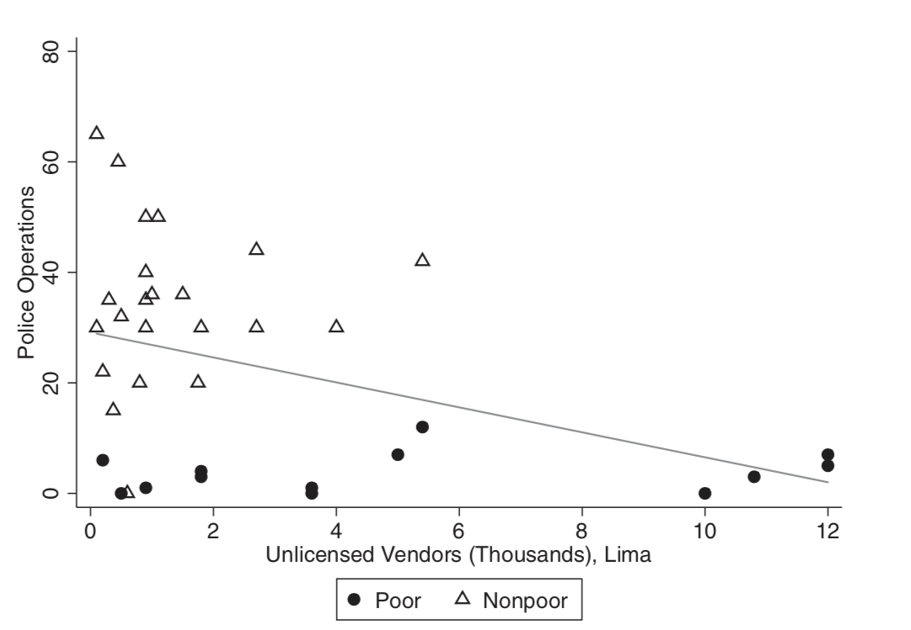
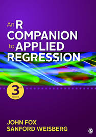

<style type="text/css">
h1.title {
  font-size: 38px;
  color: Dark;
  font-weight:bold;
}
</style>
 
---

# **Objetivos**

+ Introducir el método de Regresión Lineal Simple en el software estadístico `R`.
+ Ejercitarse en la interpretación de los componentes de una Regresión Lineal Simple.
 
---

# **Contexto del ejercicio**

Usted tiene la hipótesis de que el puntaje obtenido en la PSU de matemáticas está determinado por el promedio de de notas obtenido en la enseñanza media (NEM). Concretamente usted cree que a mayor NEM de un estudiante, mayor es el puntaje obtenido en la PSU de matemáticas. Esta relación se puede formalizar de la siguiente manera: 

<br/>

<center>
<div style="background-color:lavender">
$$PuntajeMate_{i} = \beta_{0} + \beta_{1}nem_{i} + \mu$$
</div>
</center>

<br/>

+ **Explique los componentes de la representación formal de un modelo de regresión simple**

+ **¿Incide la posición de las variables dentro de una relación cuando se produce un análisis de regresión? **  

---

# **Datos**

En esta oportunidad utilizaremos la base de datos `psu_sample` que es un extracto con información de 11762 estudiantes que rindieron la PSU para el año 2016. Las variables a utilizar son las siguientes: 

+ **Variable Dependiente**: Puntajes en la prueba de matemáticas (`mate`) 
+ **Variable Independiente**: Promedio de notas de enseñanza media (`x_nem`) 

Además utilizaremos las funciones base de `R` y las librerías `dplyr` y `car`. Aplicamos las siguientes configuraciones inciales: 

```{r, echo=TRUE, message=FALSE, warning=FALSE}
##Configuraciones iniciales
rm(list = ls()) #Limpiamos la memoria
#install.packages("dplyr")#Para manipulación de datos
#install.packages("car")#Funciones para estimar regresiones
#install.packages("haven") #lectura/importar de bases de datos en stata

##Cargar librerías
library(dplyr)
library(car)
library(haven)
#search() #Revisamos los paquetes y herramientas instaladas
options(scipen=999) #Desactivamos la notación científica
```


---

# **Ejercicio**

**1. Desde el script: Carge los datos `psu_sample` y mantenga solamente las variables de interés**.

```{r, echo=TRUE, eval=TRUE}
#Importamos la base que está en formato dta
psu_sample <- read_dta("psu_sample.dta")
#Transformamos a un marco de datos
psu_sample <- as.data.frame(psu_sample)
#Seleccionamos las variables:
#V. Dependiente: Puntaje en la prueba de matemáticas (mate) 
#V. Independiente: Promedio notas medias (x_nem)
psu_sample <- subset(psu_sample, select = c(mate,x_nem))
head(psu_sample)
```

---

**2. Analice con estadística descriptiva univariada ambas variable. Solicite un histograma para cada variable y evalúe el tipo de distribución que tiene**

+ Estadística descriptiva:

```{r, echo=TRUE, eval=TRUE}
summary(psu_sample$mate)
sd(psu_sample$mate) 
summary(psu_sample$x_nem)
sd(psu_sample$x_nem)
```

+ Tabla de calidad

{width=600px}

+ Histogramas:

```{r, echo=TRUE, eval=TRUE}
#Histogramas sin especificaciones
hist(psu_sample$mate)
hist(psu_sample$x_nem)

#Figura de calidad
?hist #Revisamos las opciones de la función
hist(psu_sample$mate, 
     main="Fig.1 Histograma PSU de matemáticas", #Nombre del histograma
     ylab = "Frecuencia", #Etiqueta el eje y
     xlab="Puntaje",      #Etiqueta el eje y
     border="black",      #Color del borde de cada barra
     col = "gray",        #Color al interior de cada barra
     xlim=c(200,850),     #Límites del eje x
     ylim=c(0,2500),      #Límites del eje y
     las=1,               #Orientación de los datos del eje x
     breaks=20)           #Quiebre de cada barra
  
hist(psu_sample$x_nem, 
     main="Fig. 2 Histograma Notas de enseñanza media",
     ylab = "Frecuencia",
     xlab="Promedio NEM",
     border="black",
     col = "gray",
     xlim=c(45,70), 
     ylim=c(0,2000),
     las=1,
     breaks=20)
```

---

**3. Formule los modelos de regresión simple teóricos y estimados para la hipótesis presentada. Describa también los modelos teóricos explicando a qué corresponde cada uno de sus componentes.**


+ El modelo teórico:

$$PuntajeMate = \beta_{0} + \beta_{1}nem + \mu$$

+ El modelo estimado:

$$\widehat{Puntaje Mate}= \widehat{\beta_{0}} + \widehat{\beta_{1}}nem $$

A estas ecuaciones se les llama **modelo de regresión lineal simple**, ya que relaciona solamente dos variables: la dependiente `Y` y la independiente `X` (podría ser multivariado e incorporar más de una variable independiente). La variable dependiente -puntaje de matemáticas obtenido en la PSU-, o también conocida como variable de respuesta o explicada, es aquella que como bien dice su nombre, queremos explicar a partir de las variables independientes del modelo. Estas últimas por otro lado, también conocidas como explicativas, son aquellas que buscan explicar la varianza de la variable dependiente respectiva. 

Luego, tenemos tres términos adicionales: $\beta_{1}$, la constante $\beta_{0}$ y el error $\mu$. $\beta_{1}$ es el parámetro de la pendiente en la relación entre `Y` y `X` cuando todos los demás factores permanecen constantes, esto es, mide el efecto de la variable explicativa sobre la explicada ceteris paribus. Luego, la constante es el intercepto de la recta en el eje `Y`, es decir, el valor que toma nuestra variable dependiente cuando nuestra independiente toma el valor cero. Finalmente, el término error representa los factores distintos de `X` (variable independiente observada) que afectan a `Y`, es decir, representa todo lo no observado del modelo.

---

**4. Grafique la relación entre ambas variables. ¿Se observa una asociación?**

+ Para graficar su relación:
```{r, echo=TRUE, eval=TRUE}
#General
#?scatterplot #Consultamos la función
scatterplot(psu_sample$x_nem, psu_sample$mate,
            boxplots=FALSE, #quitamos boxplots
            regLine = list(col="red"), #agregamos una línea de asociación
            grid = FALSE, #sacamos el fondo cuadriculado
            smooth=FALSE, #limpiamos de otras estimaciones
            cex = 0,    #Tamaño relativo de cada estimación 
            main = "Fig. 3 Asociación PSU de matemáticas y NEM",
            ylab = "Puntaje PSU de matemáticas",
            xlab = "Promedio NEM") 

#Matriz
#?scatterplotMatrix #Exploramos la función
scatterplotMatrix(~x_nem + mate, data=psu_sample,
                  regLine = list(col="red"), #agregamos una línea de asociación
                  plot.points = FALSE, #Sacamos cada uno de los valores
                  smooth=FALSE, #limpiamos de otras estimaciones,
                  var.labels=c("Promedio NEM", "Puntaje PSU de matemáticas"), cex.labels = 1,
                  main = "Fig. 4 Asociación PSU de matemáticas y NEM", row1attop = F)
```

---

**5. Calcule la correlación entre ambas variables. ¿Cuál es la intensidad y sentido de la asociación?**

```{r, echo=TRUE, eval=TRUE}
cor(psu_sample$mate, psu_sample$x_nem, method = "pearson")
```

El coeficiente de correlación de Pearson mide la fuerza y dirección con que se relacionan linealmente dos variables continuas.

---

**6. Estime el modelo de regresión simple asociados a la hipótesis. Interprete el coeficiente de regresión, el intercepto y el $R^{2}$ no ajustado.**

```{r, echo=TRUE, eval=TRUE}
#Generamos un objeto con la información de la regresión 
m1 <- lm(mate~x_nem,data=psu_sample)
summary(m1)

#Estimación manual de cada coeficiente
#Coeficiente de regresión 
beta <- cov(psu_sample$x_nem,psu_sample$mate)/var(psu_sample$x_nem)
beta
#Intercepto
mean(psu_sample$mate) - beta*mean(psu_sample$x_nem)
# Modelo is Yi = -230.38 + 13.35*X 

#Ajustes del modelo
#R Cuadrado ajustado: 0.3572
summary(m1)$r.square
#Otra opción
sse = sum((fitted(m1) - mean(psu_sample$mate))^2) # SSE
ssr = sum((fitted(m1) - psu_sample$mate)^2) # SSR
1 - (ssr/(sse + ssr))

#R Cuadrado no ajustado: 0.3571
summary(m1)$adj.r.squared

#Graficamos la regresión 
plot(psu_sample$x_nem, psu_sample$mate,
     col  = "blue", pch = 19, cex = 0.3, lty = "solid", lwd = 2,
     xlim=c(40,70), 
     ylim=c(200,850),
     main = "Fig. 5 Asociación PSU de matemáticas y NEM",
     ylab = "Puntaje PSU de matemáticas",
     xlab = "Promedio NEM")
abline(lm(mate ~ x_nem,data=psu_sample), col="red")

```

+ Tabla de calidad

{width=600px}

---

**7. Calcule el valor predicho para un estudiante con el NEM más bajo, para un estudiante en el 50% de la distribución, y para el estudiante con el NEM más alto. Interprete sus resultados**

```{r, echo=TRUE, eval=TRUE}
#Primero identificamos el promedio NEM más bajo
min(psu_sample$x_nem)
#Segundo identificamos el promedio NEM más bajo
median(psu_sample$x_nem)
#Tercero identificamos el promedio NEM más alto
max(psu_sample$x_nem)

#Podemos obtener esta información en una línea de código
summary(psu_sample$x_nem)

#Con esta información estimamos el valor predicho en la PSU de matemáticas para cada promedio:
#Puntaje PSU mate para el promedio NEM más bajo
-230.3834 + 13.3462*41
#Puntaje PSU mate para el promedio NEM del ubicado en el centro de la distribución
-230.3834 + 13.3462*57
#Puntaje PSU mate para el promedio NEM más alto
-230.3834 + 13.3462*70

```

---

**8. Calcule el valor predicho para todos los estudiantes de la muestra. Solicite descriptivos para esta nueva variable e interprete.**

```{r, echo=TRUE, eval=TRUE}
#Generamos una nueva variable (columna) a nuestro marco de datos con los valores predichos
#Manualmente
psu_sample$predict <- -230.3834 + 13.3462*psu_sample$x_nem
#Lo podemos extraer de nuestra regresión
psu_sample$predict <- predict(m1)
#Obtenemos los descriptivos de la variable
mean(psu_sample$predict)
sd(psu_sample$predict)

#Generamos un histograma de calidad
hist(psu_sample$predict, 
     main="Fig. 6 Histograma de valores predichos",
     ylab = "Frecuencia",
     xlab="Puntaje predicho",
     border="black",
     col = "gray",
     xlim=c(350,750), 
     ylim=c(0,2000),
     las=1,
     breaks=20)
```

---

**9. Calcule los residuos de la regresión anterior. Calcule la correlación y grafique la relación entre los valores predichos y los residuos. ¿Cómo se explican estos resultados ¿Cuáles son las observaciones de mayor y menor residuo?**

```{r, echo=TRUE, eval=TRUE}
#Estimamos los residuos
#Manualmente
psu_sample$residuo <- psu_sample$mate - psu_sample$predict
#Lo podemos extraer de nuestra regresión
psu_sample$residuo <- residuals(m1)
#Revisamos nuestra base de datos
head(psu_sample)

#Correlación de valores predichos y residuos
cor(psu_sample$predict, psu_sample$residuo)

#Gráfico entre valores predichos y residuos
plot(psu_sample$predict, psu_sample$residuo,
     col="blue", pch = 19, cex = 0.3, lty = "solid", lwd = 2,
     main = "Fig. 7 entre valores predichos y residuos",
     ylab = "Residuos",
     xlab = "Valores predichos PSU matemáticas")
abline(lm(predict ~ residuo,data=psu_sample), col="red")

#Generamos una nueva columna con los residuos en valor absoluto
min(abs(psu_sample$residuo))
max(abs(psu_sample$residuo))
psu_sample$absres <- abs(psu_sample$residuo)
#Identificamos la observación con menor residuo
minres <- psu_sample %>% 
  filter(absres==min(psu_sample$absres))
#Identificamos la observación con mayor residuo
maxres <- psu_sample %>% 
  filter(absres==max(psu_sample$absres))

#Podemos tener una idea general de nuestros residuos:
?arrange #Nos permite ordenar una base de datos
psu_sample <- arrange(psu_sample, absres)
brief(psu_sample)
```

---

**10. Mencione una variable no observada que podría estar sesgando las estimaciones OLS al no ser incluida en el modelo. ¿Por qué se produciría este sesgo?**

Algunas variables no observadas que podrían estar sesgando nuestros resultados son: educación de la padre/madre, tipo de dependencia del establecimiento (municipal/particular subvencionado/privado), género. No considerar estas variables estarian omitiendo explicaciones alternaticas en los resultados en la PSU de matemáticas, por lo tanto se estaría obteniendo un coeficiente sesgado. 

**¿Qué podemos hacer?**

---

# **Ejemplos** 

## Tabla

{width=800px}

## Gráfico

Este es el gráfico que deben replicar para el ejercicio. No olviden:

+ Nombrar la figura 
+ Etiquetar ejes 
+ Agregar una nota con información relevante: Nº de observaciones, significancia estadística, etc. 


{width=400px}

---

# **Referencias**

## Libro base de contenidos:

[Wooldridge, Jeffrey M. (2009). Introducción a la econometría: un enfoque moderno. 4a edición. Mé́xico: Cengage Learning.](https://www.dropbox.com/sh/t0s4r6yuzgcwt10/AAB9DxspiUmAqihGAITmhQpca?dl=0)

+ Caps 2.1- 2.4 y 2.6 para regresión simple 


## Libro base del curso para el uso R

[Fox, John y Sanford Weisberg (2019). An R Companion to Applied Regression. Third Edition. SAGE.](https://www.dropbox.com/sh/t0s4r6yuzgcwt10/AAB9DxspiUmAqihGAITmhQpca?dl=0)

+ Caps 1 y 2.
+ Gráficos: p.134 - p.138




## Ayudantías

Puedes encontrar las carpetas con las ayudantías en pdf y bases de datos en el siguiente [Link](https://github.com/JDConejeros/SOL201S_Datos_3)  

La próxima ayudantía veremos: 

+ Control estadístico
+ Introducción al modelo de regresión múltiple

---


