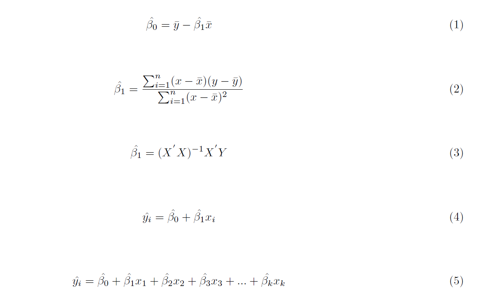

<style type="text/css">
h1.title {
  font-size: 38px;
  color: Dark;
  font-weight:bold;
}
</style>
 
---

# **Objetivos**

+ Repasar los conceptos fundamentales de la primera parte del curso.

```{r message=FALSE, warning=FALSE, include=FALSE}
##Configuraciones iniciales
rm(list = ls()) #Limpiamos la memoria
#Librerias 
library(kableExtra)
```

---

# **Ejercicio**

**1. Los padres de Sara están preocupados porque creen que su estatura es baja para su edad. Su médico ha ido registrando las siguientes alturas:**

```{r echo=FALSE, message=FALSE, warning=FALSE}
edad <- c(36, 48, 51, 54, "", "", 37.11, 1.64, 38.75)
altura <- c(83, 87, 90, 91, "", "", "", "", "")
names <- c("", "", "", "", "", "", "SSE", "SSR", "SST")
tabla <- cbind(names, edad, altura)
colnames(tabla) <- c("", "Edad (meses)", "Altura (cm)")

kable(tabla, format="html", booktabs =TRUE, linesep = "", row.names = FALSE,
      align = c("cc"), 
      caption = "Tabla 1", 
      digit=3) %>%
  kable_styling(latex_options =c("hold_position"))
```

**Con los datos de la tabla, realice las siguientes actividades:**

--- 

**1. Realice las siguientes estimaciones:**

---

**a. Estime el R cuadrado no ajustado y el cuadrado ajustado. Interprete sus resultados:**

+ R cuadrado no ajustado:

```{r, echo=TRUE, eval=TRUE, warning=FALSE}
37.11/38.75 #SSE/SST
```

Esto significa que la edad de Sara explica el 96% de la varianza de su altura.

+ R cuadrado ajustado:

```{r, echo=TRUE, eval=TRUE, warning=FALSE}
1.64/(4-1-1) #SSR/n-k-1 
38.75/(4-1) #SST/n-1
1-(0.82/12.92) #1 - (SSR/n-k-1 / SST/n-1)
```

El R cuadrado ajustado no tiene interpretación en términos de varianza. Entonces, ¿para qué sirve?

---

**b. Estime la correlación lineal entre edad y altura:**

+ La correlación se puede estimar como la raíz cuadrada del R cuadrado no ajustado:

```{r, echo=TRUE, eval=TRUE, warning=FALSE}
(0.9577)^(1/2)
sqrt(0.9577)
```

---

**c.	La desviación estándar de edad es 7,89 y la desviación estándar de altura es 3,59. En base a esta información y a sus cálculos en los puntos a) y b), estime el coeficiente de regresión estandarizado, asumiendo que altura es la variable dependiente y edad la variable independiente. Interprete el coeficiente de regresión estandarizado estimado.** 

+ Coeficiente de regresión no estandarizado:

$$\beta  = r \frac{S_{y}} {S_{x}}$$

```{r, echo=TRUE, eval=TRUE, warning=FALSE}
(0.98*3.59/7.89) #beta=r*(Sy/Sx)
```

+ Coeficiente de regresión estandarizado:

$$\beta^{S}  = \frac{\sigma_{x} \beta_{x}} {\sigma_{y}}$$

```{r, echo=TRUE, eval=TRUE, warning=FALSE}
(7.89*0.45/3.59) #beta_s=(Ox*bx)/Oy
```


Esto significa que ante el aumento de una desviación estándar en la edad de Sara, su altura aumenta en 0,98 desviaciones estándar.

---

**d. Se sabe que el intercepto de la regresión de la altura con edad como predictor es 66,69. Con esta información más sus estimaciones formule el modelo estimado. Además, utilice el modelo estimado para estimar la altura predicha de Sara a los 40 años (480 meses). Comenté su resultado, ¿le parece razonable? **

+ La altura predicha de Sara a los 40 años es:

$$\widehat{Altura} = 66.69 + 0.45*Edad$$

```{r, echo=TRUE, eval=TRUE, warning=FALSE}
66.69+0.45*480 #Altura predicha de Sara a los 40 años.
```

La predicción dice que Sara a los 40 años medirá más de 2 metros de altura. Esto no tiene sentido, ¿está nuestro modelo erróneo?

La predicción dice que Sara a los 40 años medirá más de 2 metros de altura. Claramente, esto no tiene sentido. La razón de esta estimación es que estamos trabajando con un modelo que asume una relación lineal entre las dos variables.

---

**e. Un investigador colecciona datos para Julia y los compara con los de Sara. Ambas nacieron el mismo año. Su objetivo es conocer si hay diferencias estadísticamente significativaS en la altura de ambas. Para ello realiza un test de medias y llega al siguiente resultado: beta = 0,33; Error estándar = 0,07; p < = 0,05 (test de dos colas). En base a esta información realice las siguientes actividades: **

---

**i. Formule hipótesis nula y la alternativa**

$${H_{0}}: {\mu_{Sara}} - {\mu_{Julia}} = 0$$
$${H_{1}}: {\mu_{Sara}} - {\mu_{Julia}}\neq 0$$

---

**ii. Interprete los resultados del test de medias: **

El test de medias indica que se rechaza la hipótesis nula a un 95% nivel de confianza. Esto significa, que las alturas promedio de Sara y Julia se diferencian significativamente.

---

**2. Cada una de las siguientes afirmaciones contiene un error. Explique en cada caso dónde está:  **

--- 

**a. Los datos de Sara representados en la Tabla 1 son datos transversales. **

Incorrecto. Los datos son una serie de tiempo, ya que para una sola unidad de análisis (Sara), hay información en distintos puntos del tiempo.

---

**b. Hay una correlación lineal alta entre el sexo de los y las trabajadoras y sus ingresos. **

Es incorrecto hablar de correlación lineal cuando se trata de variables categóricas, sino que se utiliza solo para estudiar la asociación entre dos continuas. En este caso, como sexo es dicotómica, entonces no es válido usar el término correlación lineal.

---

**c. La correlación lineal hallada entre la densidad de la siembra y el rendimiento del maíz fue de r = 0,23 hectolitros. **

La correlación lineal tiene una escala predefinida que va de -1 a 1, por lo que no es correcto interpretarla en base a las escalas originales de las variables.

---

**d. En un modelo OLS, la correlación lineal entre los residuos y los valores predichos puede ser distinta de cero. **

Falso, la correlación entre los residuos y los valores predichos es siempre cero. Los residuos denotan la varianza no explicada de la variable dependiente no explicada por el modelo. Los valores predichos refieren, por el contrario, a la varianza de la variable dependiente que sí es explicada por el modelo.

---

# **Resumen**




Se consideran los contenidos desde la clase 1 a la 11. 

---

# **Referencias**

## Libro base control estadístico

[Moore, David S. (2000). Estadística aplicada básica. Segunda edición. Barcelona: Antoni Bosh](https://www.dropbox.com/sh/t0s4r6yuzgcwt10/AAB9DxspiUmAqihGAITmhQpca?dl=0&preview=Moore+2000.pdf)

+ Caps 1.1, 2.3, 2.4 & 2.5 


## Libro base regresión

[Wooldridge, Jeffrey M. (2009). Introducción a la econometría: un enfoque moderno. 4a edición. Mé́xico: Cengage Learning.](https://www.dropbox.com/sh/t0s4r6yuzgcwt10/AAB9DxspiUmAqihGAITmhQpca?dl=0&preview=Wooldridge+2010.pdf)

+ Caps 2.1 - 2.4, 2.6, 3.1 - 3.3 & 6.3


## Libro base del curso para el uso R

[Fox, John y Sanford Weisberg (2019). An R Companion to Applied Regression. Third Edition. SAGE.](https://www.dropbox.com/sh/t0s4r6yuzgcwt10/AAB9DxspiUmAqihGAITmhQpca?dl=0&preview=Fox19.pdf)

+ Caps 1 y 2.


## Ayudantías

Puedes encontrar las carpetas con las ayudantías en pdf y bases de datos en el siguiente [Link](https://github.com/JDConejeros/SOL201S_Datos_3)  

---


